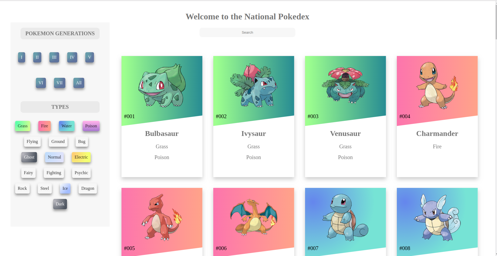
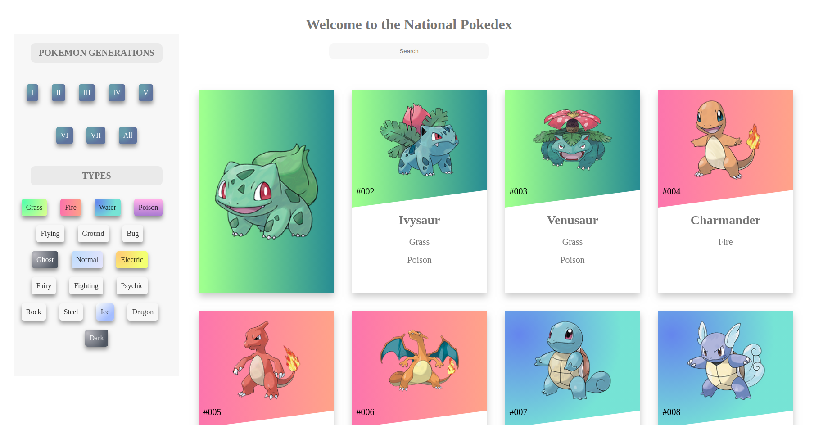

This project was made by Reactjs.

1.You can search pokemon by name, ID, type.

2.Cliking on the pokemon card will play it's sound.

3.You can filter by generation or type from the sidebar .

You can access this project on http://pokedex.abhishekcodes.in

